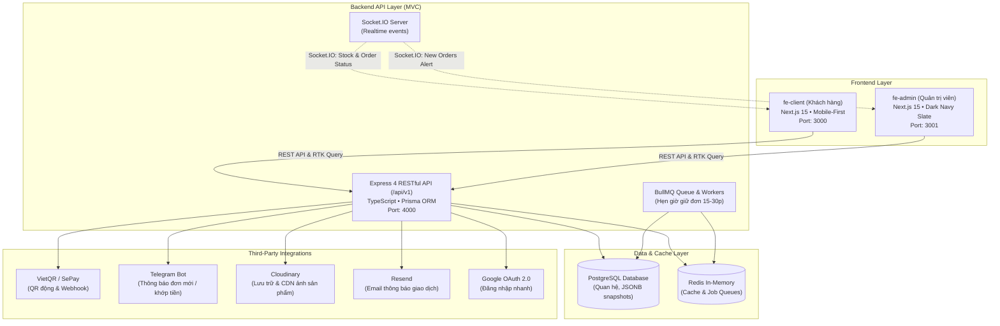

# Tiệm Len Nhà Kiều — Hệ Sinh Thái Thương Mại Điện Tử Len Handmade

> Dự án website thương mại điện tử chuyên cung cấp móc khóa và các sản phẩm len thủ công nghệ thuật. Hệ thống được kiến trúc theo mô hình **3 phân hệ độc lập** (`fe-client`, `fe-admin`, `api`) nhằm tối ưu khả năng phát triển, kiểm thử và mở rộng quy mô.

[](https://nextjs.org/)
[](https://react.dev/)
[](https://www.typescriptlang.org/)
[](https://expressjs.com/)
[](https://www.prisma.io/)
[](https://www.postgresql.org/)
[](https://redis.io/)
[](https://tailwindcss.com/)

---

## 🌐 Đường Dẫn Trực Tuyến & Demo Giao Diện

- **Cửa hàng trực tuyến (Client Storefront)**: [https://tiemlen.lesitoan.io.vn/](https://tiemlen.lesitoan.io.vn/)
- **Bảng điều khiển quản trị (Admin Dashboard)**: [https://tiemlen-admin.lesitoan.io.vn/](https://tiemlen-admin.lesitoan.io.vn/)

| 🛍️ Client Storefront (Trang Khách Hàng) | 📊 Admin Dashboard (Trang Quản Trị) |
| :---: | :---: |
| [](https://tiemlen.lesitoan.io.vn/) | [](https://tiemlen-admin.lesitoan.io.vn/) |


---

## 📑 Mục Lục

- [1. Giới Thiệu Dự Án](#1-giới-thiệu-dự-án)
- [2. Kiến Trúc Hệ Thống Tổng Thể](#2-kiến-trúc-hệ-thống-tổng-thể)
- [3. Bảng Công Nghệ Toàn Dự Án](#3-bảng-công-nghệ-toàn-dự-án)
- [4. Cấu Trúc Mã Nguồn (Codebase Structure)](#4-cấu-trúc-mã-nguồn-codebase-structure)
- [5. Luồng Nghiệp Vụ Cốt Lõi](#5-luồng-nghiệp-vụ-cốt-lõi)
- [6. Yêu Cầu Môi Trường Cài Đặt](#6-yêu-cầu-môi-trường-cài-đặt)
- [7. Hướng Dẫn Cài Đặt & Khởi Chạy Nhanh](#7-hướng-dẫn-cài-đặt--khởi-chạy-nhanh)
- [8. Danh Mục Lệnh Thao Tác (Scripts)](#8-danh-mục-lệnh-thao-tác-scripts)
- [9. Tài Liệu Kỹ Thuật Chi Tiết Từng Phân Hệ](#9-tài-liệu-kỹ-thuật-chi-tiết-từng-phân-hệ)

---

## 1. Giới Thiệu Dự Án

**Tiệm Len Nhà Kiều** là website thương mại điện tử chuyên kinh doanh các mặt hàng quà tặng và móc khóa đan móc thủ công (handmade crochet keychains: hoa tulip, thú bông, bình hoa len, nhân vật hoạt hình).

### Đặc thù nghiệp vụ:
- **100% thanh toán trước qua chuyển khoản VietQR**: Loại bỏ hoàn toàn rủi ro bom hàng COD đối với sản phẩm thủ công gia công tỉ mỉ theo đơn.
- **Yêu cầu đăng nhập trước khi thanh toán**: Khách hàng đăng nhập qua Email hoặc Google Sign-in để đảm bảo độ tin cậy của thông tin giao hàng và theo dõi đơn tiện lợi.
- **Tự động hóa hoàn toàn luồng thanh toán và hủy đơn**: Tích hợp quét mã QR ngân hàng tự động, Webhook khớp tiền tức thì, thông báo đa kênh (Realtime WebSockets & Telegram Bot), cùng cơ chế hẹn giờ hủy đơn giải phóng tồn kho bằng hàng đợi Redis + BullMQ.

---

## 2. Kiến Trúc Hệ Thống Tổng Thể

Hệ thống phân tách thành **3 khối độc lập** giao tiếp thông qua RESTful API v1 và Socket.IO:



---

## 3. Bảng Công Nghệ Toàn Dự Án

| Phân hệ | Khung phát triển | Thư viện chính | Quản lý State / Data |
| :--- | :--- | :--- | :--- |
| **`fe-client`**<br>(Storefront) | **Next.js 15** (App Router)<br>React 19, TypeScript | Tailwind CSS 3, Lucide React, Swiper, PhotoSwipe, React Hook Form, Google OAuth | **Redux Toolkit** (LocalStorage Cart)<br>**RTK Query** (Server cache) |
| **`fe-admin`**<br>(Dashboard) | **Next.js 15** (App Router)<br>React 19, TypeScript | Tailwind CSS (Dark Navy Theme), Recharts, React Hook Form, Lucide React, Swiper | **Redux Toolkit**<br>**RTK Query** (Auto invalidation) |
| **`api`**<br>(Backend) | **Node.js 20+**<br>Express 4, TypeScript | Prisma ORM 7, Zod, BullMQ 6, Socket.IO 4, Telegraf, Resend, Multer, Pino | **PostgreSQL** (Dữ liệu quan hệ)<br>**Redis** (BullMQ & Cache) |

---

## 4. Cấu Trúc Mã Nguồn (Codebase Structure)

```txt
ShopLen/
├── api/                         # Backend RESTful API chuẩn MVC & Socket.IO
│   ├── prisma/                  # Schema cơ sở dữ liệu & Migrations
│   ├── src/                     # Controllers, Services, Routes, Models, DTOs, Queues
│   ├── .env.example             # Mẫu cấu hình môi trường backend
│   └── README.md                # Tài liệu kỹ thuật chi tiết Backend API
├── fe-client/                   # Giao diện website khách hàng (Storefront)
│   ├── src/                     # App Router, Screens, Components, Slices, RTK Query
│   ├── .env.example             # Mẫu cấu hình môi trường client
│   └── README.md                # Tài liệu kỹ thuật chi tiết Phân hệ Khách hàng
├── fe-admin/                    # Giao diện bảng điều khiển quản trị (Dashboard)
│   ├── src/                     # App Router, Screens, Drawers, Modals, Recharts
│   ├── .env.example             # Mẫu cấu hình môi trường admin
│   └── README.md                # Tài liệu kỹ thuật chi tiết Phân hệ Quản trị
├── package.json                 # Scripts điều phối toàn bộ monorepo
└── README.md                    # Tài liệu tổng quan toàn dự án (file này)
```

---

## 5. Luồng Nghiệp Vụ Cốt Lõi

### 5.1 Luồng Đặt Hàng & Thanh Toán VietQR Tự Động
1. **Khách hàng** duyệt giỏ hàng và tiến hành thanh toán tại `/thanh-toan`.
2. Hệ thống kiểm tra phiên đăng nhập của khách (JWT) và gửi danh sách `items` lên `POST /api/v1/client/orders`.
3. Backend tạo đơn hàng ở trạng thái `PENDING_PAYMENT`, chụp snapshot thông tin sản phẩm và lập lịch đếm ngược giữ đơn trong **BullMQ**.
4. Client chuyển tới `/thanh-toan/qr/:orderId`, hiển thị mã VietQR động sinh theo mã đơn hàng cùng số tiền chính xác.
5. Khi khách chuyển khoản:
   - **Tự động**: Webhook ngân hàng (SePay) bắn về `POST /api/v1/client/payments/webhook`, đối soát mã đơn và số tiền.
   - **Thủ công**: Admin kiểm tra sao kê và bấm "Xác nhận đã thanh toán" trong Dashboard `/orders/:id`.
6. Hệ thống chuyển trạng thái đơn sang `PAID`, hủy tác vụ tự động hủy đơn trong BullMQ, đồng thời:
   - Bắn tin nhắn báo động qua **Telegram Bot** vào nhóm Admin.
   - Phát sự kiện realtime qua **Socket.IO** cập nhật màn hình khách và dashboard quản trị.

### 5.2 Luồng Hẹn Giờ Hủy Đơn & Giải Phóng Tồn Kho
- Nếu sau thời gian quy định (cấu hình 15-30 phút) đơn hàng chưa được thanh toán:
  - BullMQ Worker kích hoạt job `autoCancelExpiredOrder`.
  - Đơn tự động chuyển thành `CANCELLED`.
  - Số lượng hàng dự trừ (reserved stock) lập tức được hoàn trả lại kho sản phẩm.
  - Bắn sự kiện `stock:updated` tới toàn bộ client đang mở website.

---

## 6. Yêu Cầu Môi Trường Cài Đặt

Trước khi cài đặt, hãy đảm bảo máy tính đã cài đặt các công cụ sau:
- **Node.js**: Phiên bản `>= 20.19.0`
- **npm**: Phiên bản `>= 10.0.0`
- **PostgreSQL**: Phiên bản `14` trở lên đang chạy
- **Redis**: Phiên bản `6` trở lên đang chạy (cổng mặc định `6379`)

---

## 7. Hướng Dẫn Cài Đặt & Khởi Chạy Nhanh

### Bước 1: Clone kho lưu trữ
```bash
git clone <repository-url>
cd ShopLen
```

### Bước 2: Cài đặt Dependencies cho cả 3 phân hệ
Chỉ cần thực hiện lệnh sau tại thư mục gốc:
```bash
npm install
npm run install:apps
```
*(Lệnh trên sẽ tự động cài đặt `node_modules` cho thư mục gốc, `api`, `fe-client` và `fe-admin`).*

### Bước 3: Thiết lập các tệp môi trường (`.env`)
Sao chép tệp mẫu sang tệp `.env` cho từng phân hệ:

1. **Cấu hình Backend (`api/.env`)**:
   ```bash
   cp api/.env.example api/.env
   ```
   *Cập nhật chuỗi kết nối `DATABASE_URL`, `REDIS_URL`, khóa `JWT_SECRET`, tài khoản ngân hàng và các dịch vụ bên ngoài.*

2. **Cấu hình Client (`fe-client/.env`)**:
   ```bash
   cp fe-client/.env.example fe-client/.env
   ```
   *Mặc định: `NEXT_PUBLIC_API_URL=http://localhost:4000/api/v1`*

3. **Cấu hình Admin (`fe-admin/.env`)**:
   ```bash
   cp fe-admin/.env.example fe-admin/.env
   ```
   *Mặc định: `NEXT_PUBLIC_API_URL=http://localhost:4000/api/v1`*

### Bước 4: Đồng bộ cơ sở dữ liệu (Prisma Migration)
```bash
npm --prefix api run prisma:generate
npm --prefix api run db:migrate
```

### Bước 5: Khởi chạy toàn bộ hệ thống
Khởi chạy đồng thời cả 3 dịch vụ chỉ với một câu lệnh:
```bash
npm run dev
```

Hệ thống sẽ chạy song song tại các cổng cục bộ:
- **Backend API**: `http://localhost:4000`
- **Client Storefront**: `http://localhost:3000`
- **Admin Dashboard**: `http://localhost:3001`

---

## 8. Danh Mục Lệnh Thao Tác (Scripts)

| Lệnh | Ý nghĩa |
| :--- | :--- |
| **`npm run dev`** | Khởi chạy cùng lúc Backend API, Client và Admin ở chế độ phát triển |
| **`npm run dev:api`** | Chỉ khởi chạy riêng Backend API (`http://localhost:4000`) |
| **`npm run dev:client`** | Chỉ khởi chạy riêng Khách hàng (`http://localhost:3000`) |
| **`npm run dev:admin`** | Chỉ khởi chạy riêng Quản trị (`http://localhost:3001`) |
| **`npm run build`** | Đóng gói (Build) production cho cả 3 phân hệ |
| **`npm run build:api`** | Biên dịch mã nguồn Backend API |
| **`npm run build:client`**| Build tối ưu cho Client Storefront |
| **`npm run build:admin`** | Build tối ưu cho Admin Dashboard |
| **`npm run typeCheck`** | Kiểm tra lỗi TypeScript toàn bộ Backend |
| **`npm run lint:client`**| Kiểm tra quy chuẩn mã nguồn Client bằng ESLint |
| **`npm run lint:admin`** | Kiểm tra quy chuẩn mã nguồn Admin bằng ESLint |

---

## 9. Tài Liệu Kỹ Thuật Chi Tiết Từng Phân Hệ

Để tìm hiểu sâu hơn về kiến trúc, danh sách endpoint, component và cấu hình của từng phân hệ, vui lòng đọc các tài liệu con sau:

- 📖 **[Tài liệu Backend API (`api/README.md`)](file:///d:/CODE/ShopLen/api/README.md)** — Chi tiết RESTful endpoints, Prisma schema, BullMQ, Socket.IO.
- 📱 **[Tài liệu Frontend Client (`fe-client/README.md`)](file:///d:/CODE/ShopLen/fe-client/README.md)** — Chi tiết màn hình storefront, giỏ hàng, thanh toán VietQR, blog SEO.
- 💻 **[Tài liệu Frontend Admin (`fe-admin/README.md`)](file:///d:/CODE/ShopLen/fe-admin/README.md)** — Chi tiết dashboard thống kê, quản lý đơn hàng, kho sản phẩm, nhân sự, Telegram bot.
