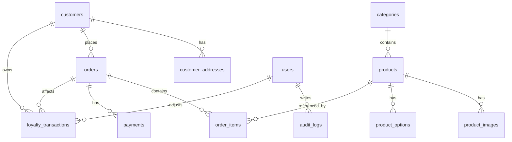

# Database Design v1 - Tiệm Len Nhà Kiều

> Tài liệu này là nguồn tham chiếu chi tiết cho thiết kế DB trước khi code migration/model API v1.
>
> API v1 dùng PostgreSQL. Tên bảng/cột trong DB dùng `snake_case`; tên field trong TypeScript/API dùng `camelCase`.

## 1. Phạm vi DB v1

### 1.1. Bảng làm trong v1

- `customers`: tài khoản khách hàng website client.
- `customer_addresses`: địa chỉ giao hàng của customer.
- `users`: tài khoản admin/nhân sự.
- `categories`: danh mục sản phẩm.
- `products`: sản phẩm.
- `product_images`: ảnh sản phẩm, có đánh dấu thumbnail.
- `product_options`: option của sản phẩm, values lưu `jsonb`.
- `orders`: đơn hàng.
- `order_items`: item trong đơn, có `product_snapshot jsonb`.
- `payments`: thanh toán QR/webhook/manual confirm.
- `loyalty_transactions`: giao dịch điểm thưởng, có thể để sau nếu chưa bật loyalty.
- `audit_logs`: log thao tác admin quan trọng.

### 1.2. Không tạo trong v1

- Không tạo `carts` vì cart lưu `localStorage`.
- Không tạo `promotions`.
- Không tạo `settings`.
- Không tạo `banners` hoặc hero slides.
- Không tạo `product_variants`.
- Không tạo bảng rating/review sao.
- Không tạo bảng social auth provider riêng; Google login nằm trong `customers`.

## 2. Quy ước chung

### 2.1. Kiểu dữ liệu

- Primary key: `uuid`.
- Thời gian: `timestamptz`.
- Tiền: `integer` theo VND, không dùng decimal cho v1.
- JSON: `jsonb`.
- Soft delete: dùng `deleted_at timestamptz null` cho bảng cần xóa mềm.
- Email lưu lowercase ở service trước khi insert/update.

### 2.2. Cột thời gian chuẩn

Các bảng chính nên có:

- `created_at timestamptz not null default now()`
- `updated_at timestamptz not null default now()`

### 2.3. Enum DB

Khuyến nghị dùng PostgreSQL enum cho status chính để dữ liệu sạch:

```sql
create type account_status as enum ('ACTIVE', 'LOCKED');
create type user_role as enum ('SUPER_ADMIN', 'ADMIN', 'STAFF_ORDER', 'STAFF_CONTENT');
create type category_status as enum ('ACTIVE', 'HIDDEN');
create type product_status as enum ('ACTIVE', 'HIDDEN', 'OUT_OF_STOCK');
create type product_highlight_type as enum ('HOT_PRODUCT', 'TODAY_DEAL', 'HOT_TIKTOK');
create type product_option_type as enum ('COLOR', 'SIZE');
create type order_status as enum ('PENDING_PAYMENT', 'PAID', 'PACKING', 'SHIPPING', 'COMPLETED', 'CANCELLED');
create type payment_status as enum ('PENDING', 'PAID', 'MISMATCHED', 'FAILED', 'REFUNDED');
create type payment_provider as enum ('VIETQR', 'SEPAY', 'CASSO', 'MANUAL');
create type payment_method as enum ('BANK_TRANSFER');
create type loyalty_transaction_type as enum ('EARN', 'REDEEM', 'REFUND', 'ADJUST');
create type gender_type as enum ('MALE', 'FEMALE', 'OTHER');
```

Nếu muốn dễ thêm enum ở giai đoạn đầu, có thể dùng `varchar` + `check constraint`. Nhưng khi đã chốt v1, PostgreSQL enum rõ ràng hơn.

## 3. Sơ đồ quan hệ



## 4. Bảng chi tiết

## 4.1. `customers`

Tài khoản khách hàng client. Không dùng cho admin.

| Cột | Type | Null | Default | Ghi chú |
|---|---|---:|---|---|
| `id` | `uuid` | no | `gen_random_uuid()` | PK |
| `code` | `varchar(30)` | no | | Mã customer hiển thị, unique |
| `full_name` | `varchar(120)` | no | | Tên khách |
| `email` | `varchar(255)` | no | | Unique, lowercase |
| `password_hash` | `text` | yes | | Null nếu chỉ Google login |
| `email_verified` | `boolean` | no | `false` | True khi Google email verified hoặc verify email thủ công |
| `is_manual_login` | `boolean` | no | `false` | Có thể login email/password |
| `is_google_login` | `boolean` | no | `false` | Đã liên kết Google |
| `google_account_id` | `varchar(255)` | yes | | Google `sub`, unique nullable |
| `phone` | `varchar(20)` | yes | | Profile phone optional |
| `gender` | `gender_type` | yes | | |
| `birthday` | `date` | yes | | |
| `avatar` | `text` | yes | | URL avatar |
| `status` | `account_status` | no | `'ACTIVE'` | |
| `reward_points` | `integer` | no | `0` | Tổng điểm hiện tại |
| `total_spent` | `integer` | no | `0` | Tổng tiền đã mua thành công |
| `total_orders` | `integer` | no | `0` | Số đơn hợp lệ |
| `last_login_at` | `timestamptz` | yes | | |
| `created_at` | `timestamptz` | no | `now()` | |
| `updated_at` | `timestamptz` | no | `now()` | |

Indexes/constraints:

- PK: `customers_pkey (id)`.
- Unique: `customers_code_key (code)`.
- Unique: `customers_email_key (email)`.
- Unique nullable: `customers_google_account_id_key (google_account_id)`.
- Optional partial unique cho phone nếu muốn tránh trùng: `unique(phone) where phone is not null`.
- Check: `reward_points >= 0`, `total_spent >= 0`, `total_orders >= 0`.
- Check auth: ít nhất một trong `is_manual_login` hoặc `is_google_login` là true sau khi account được tạo thật.

Google login/link rule:

- Nếu tìm thấy `google_account_id = sub`, login vào customer đó.
- Nếu chưa có `google_account_id` nhưng có `email` trùng và Google `email_verified = true`, link vào customer cùng email.
- Nếu chưa có email, tạo customer mới với `is_google_login = true`, `is_manual_login = false`, `password_hash = null`.
- Không auto link khi Google email chưa verified.

## 4.2. `customer_addresses`

Địa chỉ nhận hàng lưu theo customer.

| Cột | Type | Null | Default | Ghi chú |
|---|---|---:|---|---|
| `id` | `uuid` | no | `gen_random_uuid()` | PK |
| `customer_id` | `uuid` | no | | FK customers |
| `full_name` | `varchar(120)` | no | | Người nhận |
| `phone` | `varchar(20)` | no | | Phone nhận hàng bắt buộc |
| `address_line` | `text` | no | | Số nhà/đường |
| `province_name` | `varchar(120)` | no | | |
| `district_name` | `varchar(120)` | yes | | |
| `ward_name` | `varchar(120)` | yes | | |
| `is_default` | `boolean` | no | `false` | |
| `created_at` | `timestamptz` | no | `now()` | |
| `updated_at` | `timestamptz` | no | `now()` | |

Indexes/constraints:

- FK `customer_id` references `customers(id)` on delete cascade.
- Index `customer_addresses_customer_id_idx`.
- Partial unique để mỗi customer có tối đa 1 default address:
  `unique(customer_id) where is_default = true`.

## 4.3. `users`

Tài khoản admin/nhân sự. Không dùng cho khách hàng.

| Cột | Type | Null | Default | Ghi chú |
|---|---|---:|---|---|
| `id` | `uuid` | no | `gen_random_uuid()` | PK |
| `code` | `varchar(30)` | no | | Unique |
| `full_name` | `varchar(120)` | no | | |
| `email` | `varchar(255)` | no | | Unique, lowercase |
| `password_hash` | `text` | no | | Admin bắt buộc mật khẩu |
| `phone` | `varchar(20)` | yes | | |
| `avatar` | `text` | yes | | |
| `role` | `user_role` | no | `'STAFF_ORDER'` | |
| `status` | `account_status` | no | `'ACTIVE'` | |
| `last_login_at` | `timestamptz` | yes | | |
| `created_at` | `timestamptz` | no | `now()` | |
| `updated_at` | `timestamptz` | no | `now()` | |

Indexes/constraints:

- Unique `users_code_key (code)`.
- Unique `users_email_key (email)`.
- Optional partial unique phone.

Auth rule:

- Chỉ token có `tokenType = 'ADMIN'` và user active mới vào `/api/v1/admin/**`.
- Customer token không được dùng cho admin route.

## 4.4. `categories`

Danh mục sản phẩm.

| Cột | Type | Null | Default | Ghi chú |
|---|---|---:|---|---|
| `id` | `uuid` | no | `gen_random_uuid()` | PK |
| `code` | `varchar(30)` | no | | Unique |
| `name` | `varchar(160)` | no | | |
| `slug` | `varchar(180)` | no | | Unique |
| `description` | `text` | yes | | |
| `image` | `text` | yes | | |
| `display_order` | `integer` | no | `0` | |
| `status` | `category_status` | no | `'ACTIVE'` | |
| `created_at` | `timestamptz` | no | `now()` | |
| `updated_at` | `timestamptz` | no | `now()` | |

Indexes/constraints:

- Unique `categories_code_key`.
- Unique `categories_slug_key`.
- Index `(status, display_order)`.

Delete rule:

- Nếu category có product, không hard delete.
- V1 có thể chuyển `status = 'HIDDEN'` hoặc chặn xóa tùy UI admin.

## 4.5. `products`

Sản phẩm chính. Không lưu thumbnail trực tiếp trong bảng này.

| Cột | Type | Null | Default | Ghi chú |
|---|---|---:|---|---|
| `id` | `uuid` | no | `gen_random_uuid()` | PK |
| `code` | `varchar(30)` | no | | Unique |
| `name` | `varchar(180)` | no | | |
| `slug` | `varchar(220)` | no | | Unique trong product chưa xóa |
| `category_id` | `uuid` | no | | FK categories |
| `short_description` | `text` | yes | | |
| `description_html` | `text` | yes | | |
| `care_instruction_html` | `text` | yes | | |
| `original_price` | `integer` | no | | Giá gốc |
| `sale_price` | `integer` | yes | | Giá sale nullable |
| `stock_quantity` | `integer` | no | `0` | Tồn kho cấp product |
| `status` | `product_status` | no | `'ACTIVE'` | |
| `highlight_type` | `product_highlight_type` | yes | | Nullable |
| `sold_count` | `integer` | no | `0` | |
| `meta_title` | `varchar(180)` | yes | | SEO |
| `meta_description` | `varchar(300)` | yes | | SEO |
| `created_at` | `timestamptz` | no | `now()` | |
| `updated_at` | `timestamptz` | no | `now()` | |
| `deleted_at` | `timestamptz` | yes | | Soft delete |

Indexes/constraints:

- Unique `products_code_key (code)`.
- Partial unique slug: `unique(slug) where deleted_at is null`.
- FK `category_id` references `categories(id)` on delete restrict.
- Index `(category_id, status, deleted_at)`.
- Index `(highlight_type, status, deleted_at)`.
- Index `(created_at desc)`.
- Index `(sold_count desc)`.
- Check `original_price >= 0`.
- Check `sale_price is null or sale_price >= 0`.
- Check `sale_price is null or sale_price <= original_price`.
- Check `stock_quantity >= 0`.
- Check `sold_count >= 0`.

Business rule:

- Public API chỉ trả `status = 'ACTIVE'` và `deleted_at is null`.
- Admin có thể xem `ACTIVE`, `HIDDEN`, `OUT_OF_STOCK`.
- Product xóa mềm không làm order cũ lỗi vì order dùng `order_items.product_snapshot`.

## 4.6. `product_images`

Ảnh sản phẩm.

| Cột | Type | Null | Default | Ghi chú |
|---|---|---:|---|---|
| `id` | `uuid` | no | `gen_random_uuid()` | PK |
| `product_id` | `uuid` | no | | FK products |
| `url` | `text` | no | | URL Cloudinary |
| `public_id` | `varchar(255)` | yes | | Cloudinary public id |
| `alt_text` | `varchar(255)` | yes | | |
| `display_order` | `integer` | no | `0` | |
| `is_thumbnail` | `boolean` | no | `false` | |
| `created_at` | `timestamptz` | no | `now()` | |
| `updated_at` | `timestamptz` | no | `now()` | |

Indexes/constraints:

- FK `product_id` references `products(id)` on delete cascade.
- Index `(product_id, display_order)`.
- Partial unique thumbnail: `unique(product_id) where is_thumbnail = true`.

Rule:

- Mỗi product tối đa 1 thumbnail.
- Nếu admin không chọn thumbnail, service lấy ảnh `display_order` nhỏ nhất làm thumbnail khi trả API.
- Khi soft delete product, không cần xóa ảnh cloud ngay.

## 4.7. `product_options`

Option của sản phẩm. Mỗi loại option của một product là một bản ghi.

| Cột | Type | Null | Default | Ghi chú |
|---|---|---:|---|---|
| `id` | `uuid` | no | `gen_random_uuid()` | PK |
| `product_id` | `uuid` | no | | FK products |
| `option_type` | `product_option_type` | no | | `COLOR` hoặc `SIZE` |
| `name` | `varchar(120)` | no | | Tên hiển thị |
| `display_order` | `integer` | no | `0` | |
| `values` | `jsonb` | no | | Danh sách option values |
| `created_at` | `timestamptz` | no | `now()` | |
| `updated_at` | `timestamptz` | no | `now()` | |

`values` JSON shape:

```ts
type ProductOptionValue = {
  code: string;
  label: string;
  colorHex?: string;
  priceDiff?: number;
  isDefault?: boolean;
};
```

Indexes/constraints:

- FK `product_id` references `products(id)` on delete cascade.
- Unique `(product_id, option_type)`.
- Index `(product_id, display_order)`.
- Check `jsonb_typeof(values) = 'array'`.

Rule:

- Product có 0, 1 hoặc 2 option trong v1.
- Chỉ nhận `COLOR` và `SIZE`.
- Không tạo variant tổ hợp màu x size.
- Tồn kho vẫn ở `products.stock_quantity`.
- Giá cuối của item = product base price hiện tại + tổng `priceDiff` của option đã chọn.

Service validation nên kiểm tra:

- Không quá 2 option/product.
- Mỗi `values[].code` unique trong cùng option.
- Nếu `option_type = COLOR`, `colorHex` nên là mã màu hợp lệ khi có.
- Tối đa 1 value `isDefault = true` trong một option.

## 4.8. `orders`

Đơn hàng. V1 bắt buộc đăng nhập mới mua.

| Cột | Type | Null | Default | Ghi chú |
|---|---|---:|---|---|
| `id` | `uuid` | no | `gen_random_uuid()` | PK |
| `order_code` | `varchar(40)` | no | | Unique, dùng trong chuyển khoản |
| `customer_id` | `uuid` | no | | FK customers |
| `customer_name` | `varchar(120)` | no | | Snapshot người đặt/nhận |
| `customer_phone` | `varchar(20)` | no | | Bắt buộc dù profile phone optional |
| `customer_email` | `varchar(255)` | yes | | |
| `shipping_address` | `text` | no | | Full address snapshot |
| `shipping_province` | `varchar(120)` | yes | | |
| `shipping_district` | `varchar(120)` | yes | | |
| `shipping_ward` | `varchar(120)` | yes | | |
| `customer_note` | `text` | yes | | |
| `admin_notes` | `text` | yes | | |
| `subtotal` | `integer` | no | `0` | Tổng tiền hàng |
| `shipping_fee` | `integer` | no | `0` | |
| `discount_amount` | `integer` | no | `0` | V1 thường 0 |
| `points_discount` | `integer` | no | `0` | |
| `total_amount` | `integer` | no | `0` | Số tiền phải thanh toán |
| `used_points` | `integer` | no | `0` | |
| `earned_points` | `integer` | no | `0` | |
| `payment_method` | `payment_method` | no | `'BANK_TRANSFER'` | |
| `payment_status` | `payment_status` | no | `'PENDING'` | |
| `order_status` | `order_status` | no | `'PENDING_PAYMENT'` | |
| `expires_at` | `timestamptz` | no | | Hạn thanh toán |
| `paid_at` | `timestamptz` | yes | | |
| `cancelled_at` | `timestamptz` | yes | | |
| `cancel_reason` | `text` | yes | | |
| `shipping_unit` | `varchar(120)` | yes | | |
| `tracking_code` | `varchar(120)` | yes | | |
| `created_at` | `timestamptz` | no | `now()` | |
| `updated_at` | `timestamptz` | no | `now()` | |

Indexes/constraints:

- Unique `orders_order_code_key (order_code)`.
- FK `customer_id` references `customers(id)` on delete restrict.
- Index `(customer_id, created_at desc)`.
- Index `(order_status, created_at desc)`.
- Index `(payment_status, created_at desc)`.
- Index `(expires_at)` for order expiry job.
- Check all money fields `>= 0`.
- Check `total_amount = subtotal + shipping_fee - discount_amount - points_discount` nếu muốn enforce ở DB. Có thể để service enforce để tránh migration phức tạp khi chính sách giá thay đổi.

Rule:

- Không có field `source`.
- `customer_id` lấy từ JWT, không nhận từ body.
- Khi tạo order phải reserve stock ngay.
- Khi order hết hạn/hủy trước thanh toán, release stock.

## 4.9. `order_items`

Item trong order, lưu snapshot sản phẩm bằng `jsonb` để order cũ không phụ thuộc product hiện tại.

| Cột | Type | Null | Default | Ghi chú |
|---|---|---:|---|---|
| `id` | `uuid` | no | `gen_random_uuid()` | PK |
| `order_id` | `uuid` | no | | FK orders |
| `product_id` | `uuid` | yes | | Nullable để product có thể xóa |
| `unit_price` | `integer` | no | | Giá sau option tại thời điểm mua |
| `quantity` | `integer` | no | | |
| `total_price` | `integer` | no | | `unit_price * quantity` |
| `product_snapshot` | `jsonb` | no | | Snapshot cứng |
| `created_at` | `timestamptz` | no | `now()` | |

`product_snapshot` JSON shape:

```ts
type OrderItemProductSnapshot = {
  productId: string;
  code: string;
  slug: string;
  name: string;
  imageUrl?: string;
  categoryId?: string;
  categoryName?: string;
  originalPrice?: number;
  salePrice?: number;
  unitPrice: number;
  selectedOptions?: {
    optionType: "COLOR" | "SIZE";
    optionName: string;
    valueCode: string;
    valueLabel: string;
    colorHex?: string;
    priceDiff?: number;
  }[];
};
```

Indexes/constraints:

- FK `order_id` references `orders(id)` on delete cascade.
- FK `product_id` references `products(id)` on delete set null.
- Index `(order_id)`.
- Index `(product_id)` for analytics.
- Check `unit_price >= 0`, `quantity > 0`, `total_price >= 0`.
- Optional check `jsonb_typeof(product_snapshot) = 'object'`.

Render rule:

- Order detail đọc product name/image/options từ `product_snapshot`, không join `products` để hiển thị.
- `product_id` chỉ dùng truy vết/thống kê.

## 4.10. `payments`

Thanh toán của order.

| Cột | Type | Null | Default | Ghi chú |
|---|---|---:|---|---|
| `id` | `uuid` | no | `gen_random_uuid()` | PK |
| `order_id` | `uuid` | no | | FK orders |
| `provider` | `payment_provider` | no | | `VIETQR`, `SEPAY`, `CASSO`, `MANUAL` |
| `method` | `payment_method` | no | `'BANK_TRANSFER'` | |
| `bank_name` | `varchar(120)` | no | | |
| `bank_bin` | `varchar(30)` | no | | |
| `account_no` | `varchar(60)` | no | | |
| `account_name` | `varchar(160)` | no | | |
| `amount` | `integer` | no | | |
| `transfer_content` | `varchar(120)` | no | | Thường là order code |
| `qr_image_url` | `text` | yes | | |
| `transaction_ref` | `varchar(120)` | yes | | Provider ref, idempotency |
| `raw_webhook_payload` | `jsonb` | yes | | Payload gốc |
| `is_matched` | `boolean` | no | `false` | Match đúng order+amount |
| `status` | `payment_status` | no | `'PENDING'` | |
| `paid_at` | `timestamptz` | yes | | |
| `created_at` | `timestamptz` | no | `now()` | |
| `updated_at` | `timestamptz` | no | `now()` | |

Indexes/constraints:

- FK `order_id` references `orders(id)` on delete restrict.
- Index `(order_id, created_at desc)`.
- Unique nullable `(provider, transaction_ref)` where `transaction_ref is not null`.
- Index `(transfer_content)`.
- Index `(status, created_at desc)`.
- Check `amount >= 0`.

Rule:

- Webhook phải idempotent theo `(provider, transaction_ref)`.
- Match `transfer_content` với `orders.order_code`.
- Match `amount` chính xác với `orders.total_amount`.
- Nếu mismatch, lưu payment `MISMATCHED`, không đổi order sang paid.

## 4.11. `loyalty_transactions`

Giao dịch điểm thưởng. Có thể làm sau nếu v1 chưa bật loyalty.

| Cột | Type | Null | Default | Ghi chú |
|---|---|---:|---|---|
| `id` | `uuid` | no | `gen_random_uuid()` | PK |
| `customer_id` | `uuid` | no | | FK customers |
| `order_id` | `uuid` | yes | | FK orders |
| `change` | `integer` | no | | Dương hoặc âm |
| `type` | `loyalty_transaction_type` | no | | |
| `reason` | `text` | no | | |
| `balance_after` | `integer` | no | | |
| `actor_user_id` | `uuid` | yes | | Admin chỉnh điểm |
| `created_at` | `timestamptz` | no | `now()` | |

Indexes/constraints:

- FK `customer_id` references `customers(id)` on delete restrict.
- FK `order_id` references `orders(id)` on delete set null.
- FK `actor_user_id` references `users(id)` on delete set null.
- Index `(customer_id, created_at desc)`.
- Index `(order_id)`.
- Check `balance_after >= 0`.

Rule:

- Khi cộng/trừ điểm, update `customers.reward_points` và insert transaction trong cùng transaction DB.
- Admin adjust điểm phải có `actor_user_id`.

## 4.12. `audit_logs`

Log thao tác admin quan trọng.

| Cột | Type | Null | Default | Ghi chú |
|---|---|---:|---|---|
| `id` | `uuid` | no | `gen_random_uuid()` | PK |
| `actor_user_id` | `uuid` | yes | | User admin thực hiện |
| `action` | `varchar(120)` | no | | Ví dụ `ORDER_CONFIRM_PAYMENT` |
| `entity_type` | `varchar(80)` | no | | Ví dụ `ORDER`, `PRODUCT` |
| `entity_id` | `uuid` | yes | | Id entity nếu có |
| `before` | `jsonb` | yes | | Snapshot trước |
| `after` | `jsonb` | yes | | Snapshot sau |
| `metadata` | `jsonb` | yes | | IP/user agent/lý do |
| `created_at` | `timestamptz` | no | `now()` | |

Indexes/constraints:

- FK `actor_user_id` references `users(id)` on delete set null.
- Index `(actor_user_id, created_at desc)`.
- Index `(entity_type, entity_id, created_at desc)`.
- Index `(action, created_at desc)`.

Audit bắt buộc cho:

- Admin xác nhận thanh toán thủ công.
- Admin đổi trạng thái đơn.
- Admin hủy đơn.
- Admin chỉnh tồn kho.
- Admin chỉnh điểm khách hàng nếu loyalty bật.
- Admin xóa mềm product.

## 5. Quan hệ và hành vi xóa

| Quan hệ | FK action | Lý do |
|---|---|---|
| `customer_addresses.customer_id -> customers.id` | cascade | Xóa customer nội bộ thì địa chỉ không còn ý nghĩa |
| `orders.customer_id -> customers.id` | restrict | Không xóa customer nếu đã có order |
| `products.category_id -> categories.id` | restrict | Không xóa category khi còn product |
| `product_images.product_id -> products.id` | cascade | Image phụ thuộc product |
| `product_options.product_id -> products.id` | cascade | Option phụ thuộc product |
| `order_items.order_id -> orders.id` | cascade | Item phụ thuộc order |
| `order_items.product_id -> products.id` | set null | Order cũ vẫn sống nhờ snapshot |
| `payments.order_id -> orders.id` | restrict | Không xóa order đã có payment |
| `loyalty_transactions.customer_id -> customers.id` | restrict | Giữ lịch sử điểm |
| `loyalty_transactions.order_id -> orders.id` | set null | Không làm mất transaction |
| `audit_logs.actor_user_id -> users.id` | set null | Giữ log dù user bị xóa/ẩn |

V1 nên tránh hard delete nghiệp vụ quan trọng. Product dùng soft delete. User/customer thường đổi `status = 'LOCKED'`.

## 6. Transaction nghiệp vụ quan trọng

### 6.1. Tạo order

Trong một transaction DB:

1. Lock các product được mua bằng `select ... for update`.
2. Validate product `ACTIVE`, `deleted_at is null`.
3. Validate selected options từ `product_options.values`.
4. Tính `unit_price`, `subtotal`, `shipping_fee`, `total_amount` từ DB/config.
5. Check `stock_quantity >= quantity`.
6. Trừ/reserve `products.stock_quantity`.
7. Insert `orders`.
8. Insert `order_items` với `product_snapshot`.
9. Insert `payments` pending hoặc tạo payment sau cùng nhưng vẫn gắn order.

Sau commit:

- Emit socket `order:created`.
- Gửi Telegram cho admin nếu cấu hình có.

### 6.2. Webhook thanh toán

Trong một transaction DB:

1. Idempotency check `(provider, transaction_ref)`.
2. Tìm order theo `transfer_content = order_code`.
3. Lock order/payment liên quan.
4. So khớp amount.
5. Nếu match: update `payments.status = 'PAID'`, `orders.payment_status = 'PAID'`, `orders.order_status = 'PAID'`, set `paid_at`.
6. Nếu mismatch: insert/update payment `MISMATCHED`, giữ order `PENDING_PAYMENT`.

Sau commit:

- Emit `order:paid` nếu paid.
- Emit dashboard update cho admin.

### 6.3. Hủy hoặc hết hạn order

Trong một transaction DB:

1. Lock order.
2. Chỉ cho hủy/release nếu order chưa paid.
3. Update `orders.order_status = 'CANCELLED'`, set `cancelled_at`, `cancel_reason`.
4. Đọc `order_items`.
5. Cộng trả `products.stock_quantity` theo `order_items.product_id` còn tồn tại.
6. Ghi audit log nếu admin hủy.

## 7. Migration order đề xuất

1. Enable extension `pgcrypto` để dùng `gen_random_uuid()`.
2. Tạo enum types.
3. Tạo `customers`.
4. Tạo `users`.
5. Tạo `categories`.
6. Tạo `products`.
7. Tạo `customer_addresses`.
8. Tạo `product_images`.
9. Tạo `product_options`.
10. Tạo `orders`.
11. Tạo `order_items`.
12. Tạo `payments`.
13. Tạo `loyalty_transactions`.
14. Tạo `audit_logs`.
15. Tạo indexes bổ sung và partial unique indexes.
16. Tạo trigger update `updated_at` nếu dùng trigger DB.

## 8. Seed data tối thiểu

V1 nên seed:

- Một `SUPER_ADMIN` trong `users`.
- Một vài `categories` mẫu.
- Có thể seed 3-5 product mẫu để test client/admin.

Không seed customer thật trong production.

## 9. Ghi chú triển khai model/API

- Model TypeScript đặt trong `api/src/models`.
- DTO request/response đặt trong `api/src/dto/admin`, `api/src/dto/client`, `api/src/dto/common`.
- Type nội bộ dùng chung đặt trong `api/src/types`.
- Import nội bộ dùng alias `@/...`.
- Không để controller tự xử lý transaction hoặc query phức tạp; service chịu trách nhiệm.
- Không tin giá/stock/discount từ FE khi tạo order.
- Không join product để render order detail; luôn dùng `order_items.product_snapshot`.
